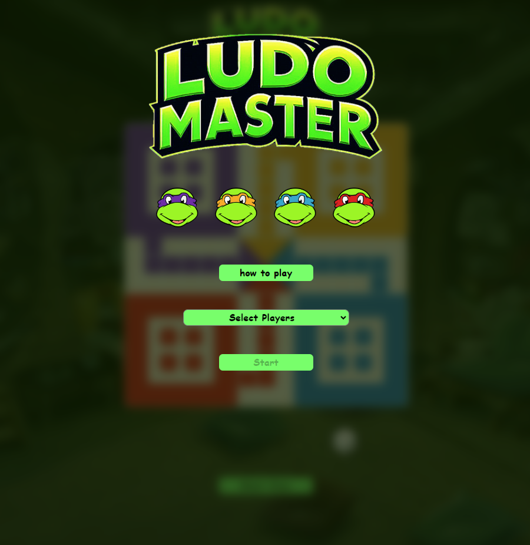
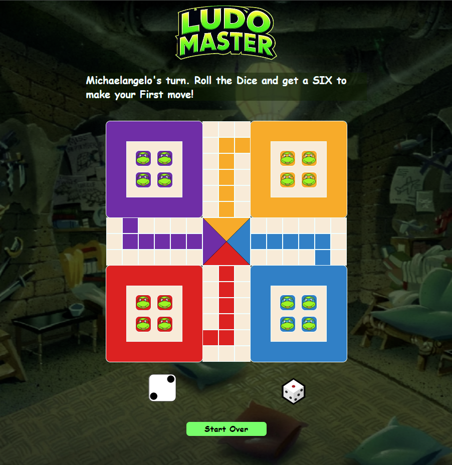

# Ludo Master

Ludo Master is based on Ludo, a classic board game enjoyed by many during their childhood, including myself. This game is designed for 2 to 4 players and is inspired by the traditional Indian game Pachisi. Ludo Master also has a Solo Player mode where you can play with computer as the 2nd player. 

## Game Overview
In Ludo, each player starts with four pieces in their home area. The objective is to move all four pieces from the starting area, around the cross-shaped board, and into the central "home" column. Players take turns rolling a die to determine their moves. Landing on a square occupied by an opponent's piece sends the opponent's piece back to the starting area.

## Motivation
As a fan of Ludo and TMNT(Teenage Mutant Ninja Turtles) since childhood, I created this web-based version to bring the two distinct flavors together to a digital screen to share it with a wider audience. I hope you enjoy playing it as much as I did growing up!!

## Getting Started
Open the link below in your web page, choose the number of players, and begin your adventure around the board. May the best strategist win!

To start playing, simply click on the link below:
# [Play Here](https://sunny-master.github.io/ludo-master/)

## Technologies used

## Planning Materials 

* [Initial Pseudocode](https://docs.google.com/document/d/1BqqMppxxZtRZoh8HkjBES30XNIsRA23K2ijtUqYRVAY/edit?usp=sharing)

> Rough work for designing the game board: 
>
> 
## Stretch Goals

* Animation for rolling the dice and landing on the dice value 
* Animation for showing the piece selection options and moving the piece
* Knock Off animation
* Option to choose the different colors for Solo player option and option to play with 3 computer players instead of one
* Option to select a different Piece 
* Option to select a different theme

## Attributions

- TMNT Sewer Lair Background:  [Comic Cart Fans](
https://www.comicartfans.com/gallerypiece.asp?piece=1324019)

- Leonardo's face: [png wing](
https://www.pngwing.com/en/free-png-kalkg)

- Single Die.m4a by Phorgador -- https://freesound.org/s/678199/ -- License: Attribution 4.0

- Wooden Hover by BenjaminNelan -- https://freesound.org/s/321082/ -- License: Creative Commons 0

- Pop 19.wav by Debsound -- https://freesound.org/s/320549/ -- License: Attribution NonCommercial 4.0

- Michaelangelo sounds: [101soundboards](
https://www.101soundboards.com/boards/11011-michaelangelo-sounds-teenage-mutant-ninja-turtles)

- Animations: [Animate.css](https://animate.style/)

